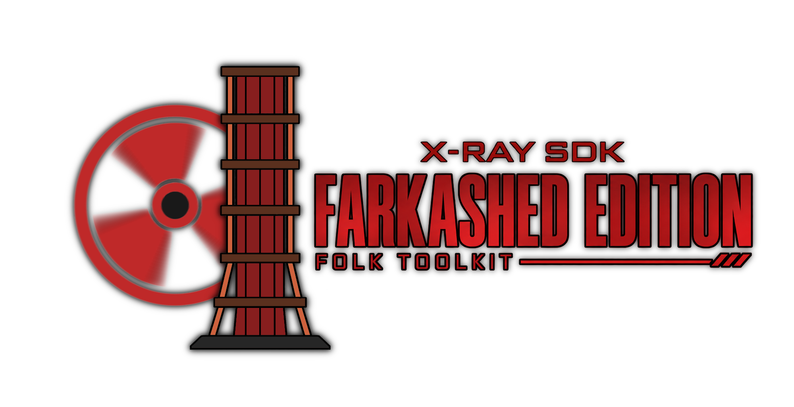

    
    

        
        
        
        
    

    

        *Farkashed не несёт в себе смысла, это просто шутка.
    

    

        Модифицированная версия X-Ray SDK 0.4, которая расширяет возможности, делает инструментарий более удобным и исправляет баги. Проект базируется на TSMP SDK (который в свою  очередь основан на X-Ray SDK 0.8 by Red Panda).
    

    

<b>Основные преимущества:</b>

    Архитектура x64: Полная поддержка 64-битных систем, что значительно ускоряет работу и позволяет работать с тяжелыми сценами.

    Современный UI: Интерфейс на базе ImGui с кастомизацией цветов и набором тем.

    Расширенный функционал: Новые фичи а так же исправление оригинальных недоработок.

    Стабильность: В отличии от оригинального сдк, модифицированная версия намного стабильнее и вызывает меньше проблем при использовании.

    Из репозитория вырезано всё, кроме самих редакторов и необходимых компонентов.

<b>Сборка</b>

Для сборки проекта в Visual Studio вам потребуется установленная рабочая нагрузка "Разработка классических приложений на C++", а также обязательно отмеченные в меню дополнительных компонентов "Средства сборки C++ для VS 2026 (v145)" и актуальный Windows SDK.
### [Установка](https://sites.google.com/view/stsocmoding/%D1%82%D1%83%D1%82%D0%BE%D1%80%D0%B8%D0%B0%D0%BB%D1%8B/%D1%81%D0%B4%D0%BA%D0%BB%D0%BE%D0%B3%D0%B8%D0%BA%D0%B0%D0%BD%D0%BF%D1%81/%D1%83%D1%81%D1%82%D0%B0%D0%BD%D0%BE%D0%B2%D0%BA%D0%B0-sdk-farkashed-edition?authuser=0)

### Credits: Zarya, TSMP, Red Panda (BearIvan), Lunar.

